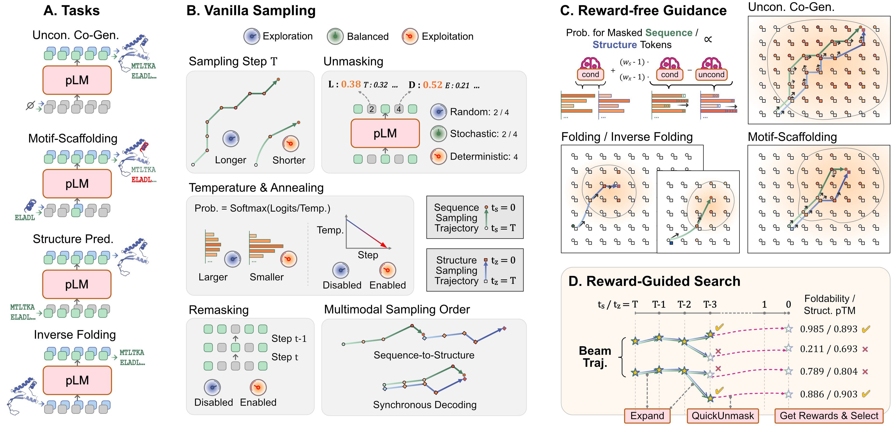

# Unlocking Multimodal Protein Language Models at Inference Time

Official implementation of [Unlocking Multimodal Protein Language Models at Inference Time](https://arxiv.org/abs/2608.25855v1).

<p align="center">
  
</p>

Our paper studies inference-time strategies for multimodal protein language models across three base models and four benchmark tasks. This repository provides reproducible pipelines for the main experiments, covering the preprocessed data, sample generation, and evaluation.

## Installation

Clone the repository and export its root directory once per shell session:

```bash
git clone https://github.com/EchoChou990919/mplm_inference.git
cd mplm_inference
export PROJECT_ROOT="$PWD"
```

### DPLM-2, DPLM-2.1, and Evaluation

Install the `dplm2` environment for DPLM-2/-2.1 generation and for all evaluations.

```bash
conda env create -f environments/dplm2.yml
conda activate dplm2

python -m pip install -e "$PROJECT_ROOT/dplm/vendor/openfold" --no-build-isolation
```

In addition, for evaluations, please download the TM-score source code and compile it on your machine.
```bash
wget https://zhanggroup.org/TM-score/TMscore.cpp
g++ -static -O3 -ffast-math -lm -o TMscore TMscore.cpp
sudo mv TMscore /usr/local/bin/
```

### ESM3

Install the `esm3` environment for ESM3 generation.

```bash
conda env create -f environments/esm3.yml
conda activate esm3
```

***NOTE**: The provided environments target a Linux machine with at least one NVIDIA GPU. We developed with CUDA 12.1. If your machine uses a different CUDA version, please adjust the `pytorch` and `torch-scatter` builds in the environment files accordingly.*

## Data preparation

The benchmark archives are included under `data/`. Please extract them from the repository root:

```bash
cd "$PROJECT_ROOT/data"
tar -xzf cameo2022.tar.gz
tar -xzf pdb_date.tar.gz
tar -xzf scaffolding_pdbs.tar.gz
```

The resulting layout should contain:

```text
data/
├── cameo2022/
├── pdb_date/
└── scaffolding_pdbs/
```

## Generation and Evaluations

Run the scripts from the corresponding model directory to reproduce the main experiments. All hyperparameters are predefined in the scripts. Generated samples (in FASTA or PDB formats) and evaluation results (in CSV format) will be saved under `dplm/generation-results/` or `esm/generation-results/`. 

### DPLM-2

```bash
cd "$PROJECT_ROOT/dplm"
conda activate dplm2

# Vanilla sampling
bash scripts/vanilla_folding_dplm2.sh
bash scripts/vanilla_inv_folding_dplm2.sh
bash scripts/vanilla_motif_scaffolding_dplm2.sh
bash scripts/vanilla_uncon_cogen_dplm2.sh

# Reward-free guidance
bash scripts/guided_folding_dplm2.sh
bash scripts/guided_inv_folding_dplm2.sh
bash scripts/guided_motif_scaffolding_dplm2.sh
bash scripts/guided_uncon_cogen_dplm2.sh
```

### DPLM-2.1

```bash
cd "$PROJECT_ROOT/dplm"
conda activate dplm2

# Vanilla sampling
bash scripts/vanilla_folding_dplm2_1.sh
bash scripts/vanilla_inv_folding_dplm2_1.sh
bash scripts/vanilla_motif_scaffolding_dplm2_1.sh
bash scripts/vanilla_uncon_cogen_dplm2_1.sh

# Reward-free guidance
bash scripts/guided_folding_dplm2_1.sh
bash scripts/guided_inv_folding_dplm2_1.sh
bash scripts/guided_motif_scaffolding_dplm2_1.sh
bash scripts/guided_uncon_cogen_dplm2_1.sh
```

### ESM3

```bash
cd "$PROJECT_ROOT/esm"
conda activate esm3

# Vanilla sampling
bash scripts/vanilla_folding.sh
bash scripts/vanilla_inv_folding.sh
bash scripts/vanilla_motif_scaffolding.sh
bash scripts/vanilla_uncon_cogen.sh

# Reward-free guidance
bash scripts/guided_folding.sh
bash scripts/guided_inv_folding.sh
bash scripts/guided_motif_scaffolding.sh
bash scripts/guided_uncon_cogen.sh

# Rewarded search
bash scripts/rewarded_folding.sh
bash scripts/rewarded_inv_folding.sh
bash scripts/rewarded_motif_scaffolding.sh
bash scripts/rewarded_uncon_cogen.sh
```
***NOTE:***
- *The first run downloads the requested model weights from their upstream model hosts. Make sure that you have network access and have accepted any applicable model license or access conditions.*
- *Certain GPUs (e.g., NVIDIA H20) may trigger a "Signal 8 (SIGFPE): Floating-Point Exception" during ESMFold-based evaluation. In our practice, this issue can be resolved by installing a specific version of the cuBLAS library: `pip install nvidia-cublas-cu12==12.4.5.8`.*

## Acknowledgements

This repository builds upon two open-source projects: 
- [DPLM-2](https://github.com/bytedance/dplm/tree/8a2e15e53416b4536f03f79ad1f6f6a9cbd5e19d): core DPLM-2/-2.1 implementations and pre-trained model weights.
- [ESM3](https://github.com/Biohub/esm/tree/453b2e2e713ee35a1dcbc684b11d03303a59294e): core ESM3 implementations and pre-trained model weights.

Their code is incorporated into the `dplm/` and `esm/` directories. For files modified or created for this project, we have added a note at the beginning of the file. Otherwise, the files are inherited from the corresponding upstream repositories. We sincerely appreciate the authors for their invaluable work and for making their code publicly available.

We also thank [EigenFold](https://github.com/bjing2016/EigenFold), [MultiFlow](http://github.com/jasonkyuyim/multiflow), and [HD-Prot](https://github.com/EchoChou990919/hdprot) for the preprocessed datasets and evaluation pipelines.

## Citation

```bibtex
@inproceedings{
    zhou2026unlocking,
    title={Unlocking Multimodal Protein Language Models at Inference Time},
    author={Yi Zhou, Qipeng Wang, Yunqing Liu, Jun Xia, Qing Li, Wenqi Fan},
    booktitle={The 2026 Conference on Empirical Methods in Natural Language Processing},
    year={2026},
}
```

If you have any questions, please contact [echo-yi.zhou@connect.polyu.hk](mailto:echo-yi.zhou@connect.polyu.hk).
